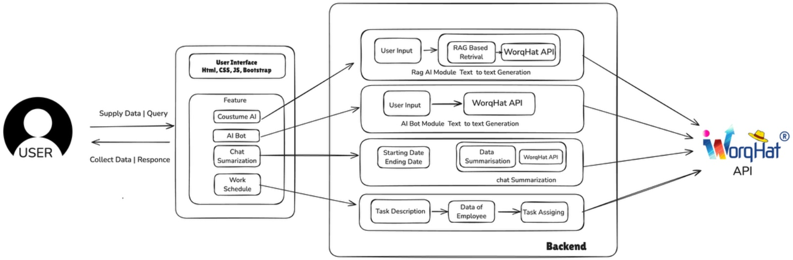

# **AI-Driven Workforce Scheduling and Collaboration Platform**

### **Introduction**
The **AI-Driven Workforce Scheduling and Collaboration Platform** is an innovative solution designed to streamline task management, enhance team collaboration, and optimize project outcomes using advanced AI technologies. This platform leverages AI to automate task assignments, summarize team discussions, and provide real-time assistance, ensuring efficient and productive workflows.

---

### **Features**
1. **AI-Powered Task Assignment**:
   - Automatically assigns tasks by analyzing employee skills, workload, and availability.
   - Ensures balanced workloads, avoiding burnout and underutilization.

2. **AI Chatbot Assistance**:
   - Provides real-time answers to project-related queries using Retrieval-Augmented Generation (RAG).
   - Retrieves knowledge from uploaded documents and collects feedback from employees.

3. **Task Summarization**:
   - Summarizes lengthy team chats into concise, actionable insights.
   - Improves communication efficiency by extracting key points from discussions.

4. **Dynamic Scheduling**:
   - Adapts task schedules in real time based on project developments and employee feedback.

5. **Gamified Engagement**:
   - Incorporates badges, rewards, and leaderboards to motivate team members and foster collaboration.

---

### **Process Flow**
1. **User Login**:
   - Users authenticate and are categorized as Managers or Employees.
2. **Manager View**:
   - Managers receive AI-suggested task assignments.
   - Can review, approve, or modify assignments and monitor team progress.
3. **Employee View**:
   - Employees view their tasks prioritized by deadlines and dependencies.
   - Access AI chatbot for project assistance and chat summaries.

---

### **Architecture**



---

### **Technology Stack**
- **Frontend**: React, HTML, CSS, JavaScript
- **Backend**: Python (Flask/Django), WorqHat APIs
- **Database**: Firebase, SQLite
- **AI Frameworks**: TensorFlow, Scikit-learn
- **Hosting**: AWS, Firebase

---


### **How to Run the Project**
1. Clone the repository:
   ```bash
   git clone <repository-url>
   ```
2. Install the required dependencies:
   ```bash
   pip install -r requirements.txt
   ```
3. Start the server:
   ```bash
   python app.py
   ```
4. Access the platform at `https://workmate-ashy.vercel.app/`.

---

### **Contributors**
- **Team Name**: CodingZen  
- **Team Leader**: Ramanuj Ladda
- **Team Member**: Nisarg Wath
- **Team Member**: Krushna Bankar
- **Team Member**: Shripad Kulkarni
